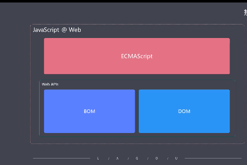
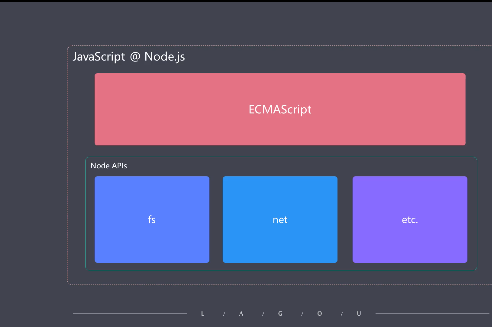
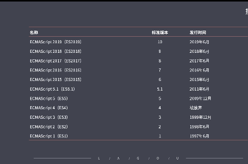
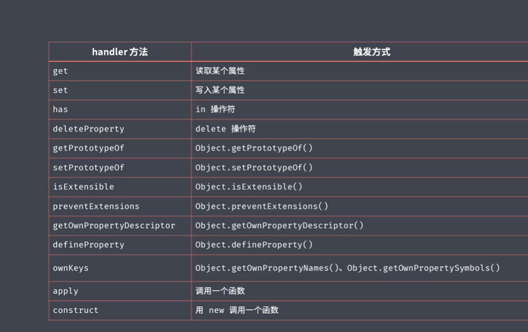
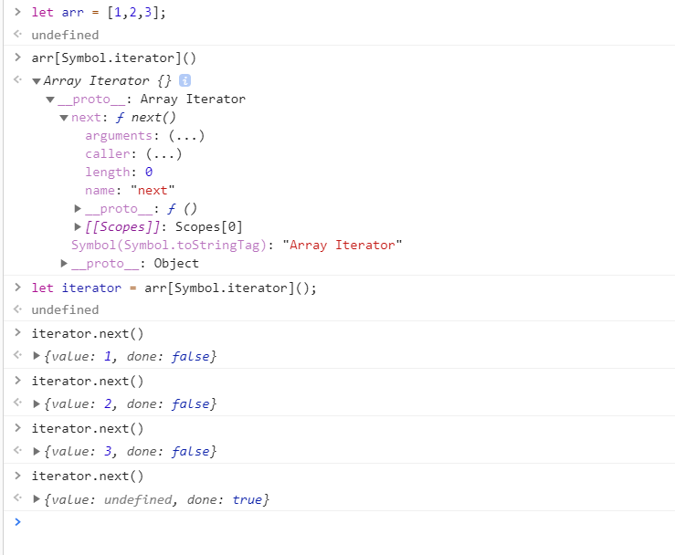

# 1. ECMAScript 的新特性

## 1.1 理解语言和平台之间的关系 (ECMAScript 与 JavaScript)

ECMAScript 是一门脚本语言(简称 es),通常把 ECMAScript 看做是 JavaScript 的标准化规范,实际上 JavaScript 是 ECMAScript 的扩张语言,因为 ECMAScript 只提供了最基本的语法(约定了我们的代码如何编写)

浏览器环境的 JavaScirpt

- 由 ECMAScript + Web API 组成(BOM + DOM)

  

Node 环境的 JavaScirpt

- 由 ECMAScript + Node API 组成(fs net etc...)

  

JavaScript 语言本身指的就是 ECMAScript

## 1.2 ECMAScript 的发展过程

从 2015 年开始 ES 保持每年一个版本的迭代



ES2015 开始按照年份命名

## 1.3 EcMaScript2015(es6)的新特性

最新 ECMAScript 标准的代表版本

- es6 相比于 ES5.1 的变化比较大
- 从这个版本开始，标准命名规则发生变化

好多人喜欢用 ES6 泛指所有的新标准

> 例如使用 es6 的 async+await

> 其实 async+await 是 es2017 制定的新特性

> 注意分辨资料中的 ES6 是指特指还是泛指

重点介绍在 ES6 在 ES5.1 基础之上的变化

- 解决原有语法上的一些问题或者不足
  - let/const 快级作用域等等
- 对原有语法进行增强
  - 解构，展开,参数默认值，模板字符串等等
- 全新的对象、全新的方法、全新的功能
  - promise,proxy,async/await 等等
- 全新的数据类型和数据结构
  - Symbol,Set,Map 等等

### 1.3.1 let 与 快级作用域

作用域: 莫个成员能够起作用的范围

在此之前：ES 只有两种作用域

- 全局作用域
- 函数作用域

ES6 之后又加了一个作用域

- 快级作用域 {}包裹的范围就是快级作用域

let 的特性

- 在块级作用域外面是无法访问块级作用域的
- for 循环中解决全局作用域带来的影响 (其实块级作用域内部也使用了闭包)
- for 循环内部其实有两层嵌套的作用域
- let 不会变量提升

const 的特点在 let 上加了只读的特性

- 变量一经声明不允许再被修改 (不能重新去指向新的内存地址)

var,let,const 使用规范

- 多使用 const，其次使用 let，尽量不使用 var

### 1.3.2 数组的解构

按照数组的顺序进行解构

- 如果解构出来的位置大于数组的长度，解构出来的属性值为 undefined
- 如果解构出来的位置小于数组的长度，其他数组的值就不会显示出来

单独解构出来一个属性，并把其他的...解构出来成一个新的数组 (...只能放在解构位置的最后面)

```js
// 写法1
const arr = [1, 2, 3];
const [a, b, c, d] = arr;
console.log(a, b, c, d); // 1,2,3, undefined
// 写法2
const [e, ...rest] = arr;
console.log(e, rest); // 1    [2,3]
```

### 1.3.3 对象的解构

按照对象的属性名进行解构

```js
const obj = { name: "zhangshan", age: 20 };
var name = "123";
// 解构左边的属性名的标识符使用
// prop ：重命名属性名
// prop = 默认值
const { name: objName, age, sex = "男" } = obj;
console.log(name, objName, age, sex);
```

解构左边的属性名的标识符使用

- prop ：重命名属性名
- prop = 默认值

解构的好处:

- 减化了我们代码的编写
- 我们代码的整体体积也减少了很多

### 1.3.4 模板字符串

模板字符串的作用

- 支持换行（利用于 html 字符串）
- 支持插值表达式的方式在字符串中去嵌入数值

```js
const name = "zhangsha";
const str = `hello ${name}
es2015`;
console.log(str);
// hello zhangsha
// es2015
```

标签模板字符串 (高级用法)

```js
const str = console.log`hello world`; // [ 'hello world' ]
const name = "zhangshan";
const gender = true;
function tagFunc(strings, name, gender) {
  const sex = gender ? "man" : "woman";
  return strings[0] + name + strings[1] + sex + strings[2];
}
const result = tagFunc`hello ${name} is a ${gender}.`;
console.log(result); // hello zhangshan is a man.
```

用处：

- 实现文本的多语言化 (翻译成中文或者英文)
- 检查模板字符串是否存在不安全的字符之内的需求
- 实现小型的模板引擎

### 1.3.5 字符串的扩展方法

- includes() 字符串是否包含这段字符
- startsWith() 字符串是否以这段字符开头
- endsWith() 字符串是否以这段字符结尾
- 相对于之前的 indexOf 和正则去判断，这上面几种方法方便很多

### 1.3.6 参数默认值

注意：

- 如果有多个参数的话，带有默认值的形参一定要出现在我们参数列表的最后。因为我们的参数是顺序传递的，如果不放在最后，那我们的默认值无法正常工作

```js
// 使用短路这种方式赋值参数默认值  (不容易区分boolean类型)
function get1(url, method, async) {
  // 缺点： 会将false也变成true
  async = async || true;
  console.log(async); // true
}
// 使用参数默认值
function get2(url, method, async = true) {
  console.log(async); // false
}
get1("getUser", "post", false);
get2("getUser", "post", false);
```

### 1.3.7 ... 的用法

剩余参数 (Rest parameters)

> 这个数组 args 会在当前位置开始加入所有的形参 (可以取代之前 argumengts 接受无线参数的方式)

> 只能出现在形参的最后一位，并且只能出现一次

```js
function foo(first, ...args) {
  console.log(first, args); // 1 [2,3,4]
}
foo(1, 2, 3, 4);
```

展开数组 (Spread)

```js
const arr = [1, 2, 3];

// 1. 展开数组
// apply原始写法
console.log.apply(console, arr); // 1 2 3
// 展开运算符写法
console.log(...arr); // 1 2 3
```

### 1.3.8 箭头函数 (Arrow functions) =>

箭头函数的语法

- =>左边表达式是参数
- =>右边就是我们函数体，如果右边函数体没有{}，就默认返回右边的值，有{}就需要自己手动返回

```js
// 传统函数的写法
// function add(num) {
//     return num + 1;
// }
// 箭头函数的写法
const add = (num) => num + 1;
console.log(add(123)); // 124
```

箭头函数与 this

- 箭头函数中没有 this 的机制，所以说他不会改变 this 的指向，也就是说我们箭头函数的外面 this 是什么，那我们在里面拿到的 this 就是什么，任何情况下都不会发生改变。
- 箭头函数的 this 始终指向当前作用域中的 this

```js
const person = {
  name: "tom",
  say1: function () {
    console.log("原始函数", `hi ${this.name}`);
  },
  say2: () => {
    // 这种情况不使用this，因为你当前所在的作用域在window上，而你需要的是person对象
    console.log("匿名函数", `hi ${this.name}`);
  },
  sayAsync1: function () {
    setTimeout(function () {
      console.log("原始函数", `hi ${this.name}`);
    }, 1000);
  },
  sayAsync2: function () {
    // 这种情况使用匿名函数,因为你当前作用域在person中
    setTimeout(() => {
      console.log("匿名函数", `hi ${this.name}`);
    }, 1000);
  },
};
// 传统函数
person.say1(); // 原始函数 hi tom
person.sayAsync1(); // 匿名函数 hi undefined
// 箭头函数
person.say2(); // 原始函数 hi undefined
person.sayAsync2(); // 匿名函数 hi tom
```

### 1.3.9 对象字面量增强 (Enhanced object literals)

- 变量名与我们要添加到对象的属性名一致的话，可以直接写个属性名就行了
- 对象里面的函数简写方式： 可以省略 :function
- 对象字面量的变量名可以使用动态值了 （计算属性名）

```js
const foo = "123";
// 传统形式
// const obj = {
//     foo: 123
// };

// es6简写属性的方式
// 1. 变量名与我们要添加到对象的属性名一致的话，可以直接写个属性名就行了
const obj = {
  foo,
  // 2. 对象里面的函数简写方式： 可以省略 :function
  method() {
    console.log(this); // { foo: '123', method: [Function: method], '0.5249172786043972': 123 }
  },
  // method: function() {
  //     console.log(this);
  // }
  // 3. 对象字面量的变量名可以使用动态值了 （计算属性名）
  [Math.random()]: 123,
};
console.log(obj); // { foo: '123', method: [Function: method], '0.5249172786043972': 123 }
obj.method();
```

### 1.3.10 对象扩展方法

- Object.assign

> 将多个源对象中的属性赋值到一个目标对象中

```js
const source1 = {
  a: 1,
  b: 1,
  c: 1,
};
const source2 = {
  b: 2,
};
const target = {
  c: 3,
  d: 3,
};
// 第一个参数就是目标对象，其他参数都是源对象
// 总结: 让后面对象的属性去覆盖第一个对象
const result = Object.assign(target, source1, source2);
console.log(result === target);
console.log(result); // { c: 1, d: 3, a: 1, b: 2 }

// 使用场景
let obj = { name: "张山", age: 20 };
function func(obj) {
  let newObj = Object.assign({}, obj);
  newObj.name = "newName"; // { name: 'newName', age: 20 }
  console.log(newObj);
}
func(obj);
console.log(obj); // { name: '张山', age: 20 }
```

- Object.is

> 判断两个值是否相等

> 一般不会用到这个方法，严格上来说用===这个比较多

```js
// 传统写法的问题
console.log(+0 === -0); // true
console.log(NaN === NaN); // false
console.log(NaN == NaN); // false

// es6的Object.is方法       新的比较方法
// 能区分+0和-0
// NaN能全等于NaN
console.log(Object.is(+0, -0)); // false
console.log(Object.is(NaN, NaN)); // true
```

### 1.3.11 proxy 代理对象

proxy 的概念

- es6 之前监控莫个对象的读写操作 （Object.defineProperty） vue3.0 之前实现双向绑定

- proxy: 为对象设置访问代理器的 (vue3.0 使用 proxy 实现双向绑定)

proxy 的基本用法如下

```js
const person = {
  name: "abc",
  age: 20,
};
// proxy返回的就是一个代理之后的对象
// proxy第一个参数是需要代理的目标对象
// 第二个参数是代理的处理对象(get,set,deleteProperty,has....方法)
const personProxy = new Proxy(person, {
  // get方法监视我们属性的访问
  get(target, property) {
    console.log(`访问了${property}属性`);
    return property in target ? target[property] : undefined; // 返回属性值
    // return target[property];
  },
  // set方法监视我们设置属性的过程
  set(target, property, value) {
    console.log(`设置了${property}属性`);
    // 在这里可以做属性值的判断
    // 例如： age属性必须是int类型
    if (property === "age" && !Number.isInteger(value)) {
      throw new TypeError(`${property} property is not an int`);
    }
    target[property] = value; // 设置属性值
  },
});
console.log(personProxy.name);
personProxy.name = "lisi";
personProxy.age = "21";
```

Proxy vs Object.defineProperty

- defineProperty 只能监视对象属性的读写 (get,set)
- Proxy 能够监视到更多对象操作(get,set,deleteProperty,has...)
- Proxy 更好的支持数组对象的监视
- defineProperty 不支持监视数组，我们使用重写数组的操作方式来实现监视数组(自定义数组的 push,shift 等方法) vue3.0 之前就是这样的
- Proxy 是以非侵入的方式监管了对象的读写
- defineProperty 需要特定的方式单独去定义对象中需要被监听的属性，需要做很多额外的操作

Proxy 能监视对象的一些方法



### 1.3.12 Reflect 统一的对象操作 API

Reflect 特点

- Reflect 属于静态类，不能实例化它的对象，只能通过静态态去调用它的静态方法 (类似 Math 对象)
- Reflect 统一提供一套用于操作对象的 API (有 14 个静态方法，其中一个被废弃调了,所有只有 13 个可用) 最大的特点 \*\*\* 官方希望使用次方法替换之前的方法

```js
//  统一提供一套用于操作对象的 API
const obj1 = {
  name: "lisi",
  age: 20,
};

// 传统操作对象的方法
// console.log("name" in obj1); // true
// console.log(delete obj["age"]); // true
// console.log(Object.keys(obj)); // [ 'name' ]

// Reflect方式
console.log(Reflect.has(obj1, "name")); // true
console.log(Reflect.deleteProperty(obj1, "age")); // true
console.log(Reflect.ownKeys(obj1)); //  [ 'name' ]
```

- Reflect 成员方法就是 Proxy 处理对象的默认实现

```js
const obj = { name: "zhangshan", age: 20 };
// 创建obj的代理对象
const proxyObj = new Proxy(obj, {
  // Reflect 成员方法就是 Proxy 处理对象的默认实现
  // 如果proxy里面没有定义get方法，内部默认就是通过Reflect实现的，如下所示
  get(target, property) {
    console.log("监听属性的逻辑");
    return Reflect.get(target, property);
  },
});
console.log(proxyObj.age);
// 监听属性的逻辑
// 20
```

### 1.3.13 Promise 对象 一种更优的异步编程解决方法

解决了传统异步编程中回调函数嵌套过深的问题(回调地狱)
在上一个模块 1 异步编程课程中有纤细介绍

promise 的出现和特点

1. 为什么会出现 Promise
   - 解决异步编程的回调地狱问题
   - 可以同时获取多个异步任务的结果
2. Promise 其实就是一个对象,表示异步任务最终结果是成功还是失败。内部对外界做出了一个承诺，一开始这个承诺是等待状态(Pending),最终可能转换成成功态(Fulfilled)或者 Rejected(失败态),在承诺状态确定之后都会有相对应的任务会被自动执行。这个承诺有个特点就是一旦确定状态之后就不能更改。
3. Promise 的 then 方法链式调用

### 1.3.14 class 类

定义类型的方式

- 在 es6 之前都是通过定义函数和函数的原型对象来实现的类型
- es6 之后是通过 clas 来实现定义类型

这种 class 独立定义类型的语法，相比较于之前函数的方式更容易理解,结构更加清晰一点

```js
// 传统方式： 通过函数和函数的原型来实现类型的定义
// function Person(name) {
//   this.name = name;
// }
// // 实例之间共享一些成员 （使用原型）
// Person.prototype.say = function () {
//   console.log(`hi ${this.name}`);
// };

// es6 的 关键词 class 方式
class Person {
  // 构造函数
  constructor(name) {
    // 访问实例成员
    this.name = name;
  }
  say() {
    console.log(`hi ${this.name}`);
  }
}
const p = new Person("lisi");
p.say(); // hi lisi
```

类型的方法，一般分为 实例方法 和 静态方法

- 实例方法只能通过这个类型构造的实例对象去调用
- 静态方法直接通过类型本身去调用
  > 以前是直接在构造函数对象中添加静态成员
  > es6 中新增添加静态成员的 static 关键词

```js
class Person {
  constructor(name) {
    // 实例成员
    this.name = name;
  }
  // 原型上的成员
  say() {
    console.log(`hi ${this.name}`);
  }
  // 静态成员
  static sayStatic(name) {
    console.log(`hi ${name}`);
  }
}

const p = new Person("实例name");
p.say();
Person.sayStatic("静态name");
// hi 实例name
// hi 静态name
```

类的继承 extends

> 通过继承的特性抽象出来相似类型之间重复的地方

- 在 es6 之前大多数都是通过函数的原型方式实现继承
- 在 es6 之后有个 extends 关键词配合 class 实现继承

```js
class Person {
  constructor(name) {
    this.name = name;
  }
  say() {
    console.log(`hi ${this.name}`);
  }
}

// Student 通过 extends 继承    Person
class Student extends Person {
  constructor(name, number) {
    super(name); // 继承自父类的name属性
    this.number = number;
  }

  sayStu() {
    super.say(); // 调用父类的say方法
    console.log(`hi ${this.name}, in ${this.number}`);
  }
}
let stu = new Student("lishi", "430422");
stu.sayStu();

// hi lishi
// hi lishi, in 430422
```

### 1.3.15 Set 数据结构

set 内部的值不允许重复的 (一般用于数组去重)

```js
const set1 = new Set();
set1.add(11).add(12).add(13).add(11);
console.log(set1); // Set { 11, 12, 13 }

// set1.forEach((i) => console.log(i));

// es6之后的方法
for (let value of set1) {
  console.log(value);
}
// 11
// 12
// 13
console.log(set1.size); // 3    长度
console.log(set1.has(13)); // true  是否存在莫一项
console.log(set1.delete(12)); // true   删除莫一项
set1.clear(); // 清空set集合所有的值

// 常见使用场景 对数组去重
let array = [1, 2, 3, 4, 5, 5, 4, 3];
console.log(Array.from(new Set(array))); // [1, 2, 3, 4, 5];
console.log([...new Set(array)]); // [1, 2, 3, 4, 5];
```

### 1.3.16 Map 数据结构

object 和 map 都是以健，值对（key,value）的形式存值
object 只能以字符串作为健，map 可以以任意数据类型作为健

```js
// object 数据结构存值
const obj = {};
obj[true] = 1;
obj[123] = 2;
obj[{ a: 1 }] = 3;
// obj的key不管设置什么类型的值内部都会转成字符串
console.log(obj); // { '123': 2, true: 1, '[object Object]': 3 }
console.log(Reflect.ownKeys(obj)); // [ '123', 'true', '[object Object]' ]
console.log(obj["[object Object]"]); //    3  有问题

// Map 数据结构存值
const map = new Map();
map.set(true, 1);
const tom = { a: 3 };
map.set(tom, 2);

console.log(map); // Map { true => 1, { a: 3 } => 2 }

console.log(map.has(tom)); // true 是否存在
console.log(map.delete(true)); // true 删除莫一项
console.log(map); // Map { { a: 3 } => 2 }
// map.clear(); // 清空所有的值
console.log(map); // Map {}

// map.forEach(value, (key) => {
//   console.log(value, key);
// });
```

### 1.3.17 Symbol 一种全新的原始数据类型

为什么会出现 symbol

- 在 es6 之前，对象的属性名都是字符串，而字符串又可能会重复的，这样会产生冲突

- 现如今我们大量使用第三方模块，都会去扩展第三方模块提供的一些对象，那此时你是不知道这个对象中是否存在莫一个指定的健，你如果直接去扩展就有可能会产生冲突的问题

- 以前解决的方式就是约定，例如变量名改为 = 模块\_变量名, 约定只是规避这个问题，并不是彻底解决这个问题， 在这个过程中有人不遵守这个问题还是会出现这个问题
- es6 为了解决上面的问题就出现了 symbol 数据类型 (symbol 表示独一无二的值)

最主要的作用就是为对象添加独一无二的的属性名

```js
// a.js
const cache = {};

// b.js
// cache["foo"] = 1;
cache["a_foo"] = 1;

// c.js
// cache["foo"] = 2;
cache["b_foo"] = 2;

// 现如今我们大量使用第三方模块，对会去扩展第三方模块提供的一些对象，那此时你是不知道这个对象中是否存在莫一个指定的健，你如果直接去扩展就有可能会产生冲突的问题
// 以前解决的方式就是约定，例如变量名改为 = 模块_变量名
console.log(cache); // { a_foo: 1, b_foo: 2 }

const s1 = Symbol();
console.log(s1); // Symbol()
console.log(typeof s1); // symbol
console.log(s1 === s1); // true

// console.log(Symbol("foo"));
// console.log(Symbol("bar"));

// const obj = {
//   [Symbol("foo")]: 1,
//   [Symbol("bar")]: 2,
// };
// console.log(obj);

// 使用 Symbol 来实现对象的私有成员
// a.js   ==========
const name = Symbol();
const person = {
  [name]: "abc", // 私有成员
  say() {
    // 普通成员
    console.log(this[name]);
  },
};

// b.js ====== 无法创建相同的 Symbol 所以无法访问a.js 的成员
// 只能调用普通的成员
person.say(); // abc
```

Symbol 的补充

- Symbol.for 方法相同的字符串得到的 symbol 是一样的
  > 内部维护了一个全局的注册表，为我们的字符串和 symbol 值提供了一一对应的关系
- 另外 Symbol 还提供了一些静态常量 Symbol.iterator,Symbol.hasInstance,Symbol.toStringTag...
- 最后 Symbol 的属性在 for 循环里面是拿不到的

```js
// 1. Symbol.for方法相同的字符串得到的symbol是一样的
// 内部维护了一个全局的注册表，为我们的字符串和symbol值提供了一一对应的关系
const s1 = Symbol.for("foo");
const s2 = Symbol.for("foo");

console.log(s1 === s2); // true
// 1.1 for内部会把值变成字符串
console.log(Symbol.for(true) === Symbol.for("true")); // true

// 2. 另外 Symbol 还提供了一些静态常量
console.log(Symbol.iterator); // Symbol(Symbol.iterator)
console.log(Symbol.hasInstance); // Symbol(Symbol.hasInstance)

// 2.1 Symbol.toStringTag 重写对象的 toString方法
const obj = {
  [Symbol.toStringTag]: "XObjecgt",
};
console.log(obj.toString()); // [object XObjecgt]

// 3. 最后 Symbol的属性在for循环里面是拿不到的
const obj3 = {
  [Symbol()]: "XObjecgt",
  foo: "normal value",
};
for (let key in obj3) {
  console.log(key);
}
// foo
// Object.keys方法只能拿到字符串的属性名
console.log(Object.keys(obj3)); // [ 'foo' ]
// JSON.stringify也会忽略Symbol的属性名
console.log(JSON.stringify(obj3)); // {"foo":"normal value"}

// Object.getOwnPropertySymbols只能拿到Symbol的属性名
console.log(Object.getOwnPropertySymbols(obj3)); // [ Symbol() ]
// console.log(Reflect.ownKeys(obj3)); // [ 'foo', Symbol() ]
```

### 1.3.18 for...of 循环

为什么会出现 for...of

> 在 es6 之前使用 for 适用于遍历普通的数组，for...in 适用于遍历健值对,再有就是一些函数式的遍历方法，例如 forEach 方法，这些遍历方式都有一定的局限性。es6 借鉴了其他语言才诞生了 for...of 循环

es6 之后 for...of 作为遍历所有数据结构的统一方式

```js
const arr = [1, 2, 3];

// 1. for...of循环遍历数组拿到的是每一项的值，传统的for循环拿到的是下标
for (const item of arr) {
  console.log(item);
}
// 1
// 2
// 3
// arr.forEach((item) => {
//   console.log(item);
// });
for (const item of arr) {
  console.log(item);
  if (item >= 2) {
    break;
  }
}
// 1
// 2

// arr.forEach()   // 不能跳出循环
// arr.some()       // 循环中返回true会跳出循环
// arr.every()      // 循环中返回false会跳出循环
// for...of()      // 循环中可以使用break跳出循环

// 2. 除了数组能通过for...of遍历，还有一些arguments,dom的一些伪数组也能遍历,已经Set,Map都能遍历
const s = new Set(["foo", "bar"]);
for (const key of s) {
  console.log(key);
}
// foo
// bar
const m = new Map();
m.set("foo", 123);
m.set("bar", 234);
for (const [key, value] of m) {
  console.log(key, value);
}
// foo 123
// bar 234

// 3. for...of 遍历普通对象
// 对象需要一个可迭代的接口才能使用for...of循环遍历对象
const obj = { foo: 123, bar: 456 };
for (const item of obj) {
  console.log(item);
}
//  TypeError: obj is not iterable
```

### 1.3.19 Iterable 可迭代接口 为了普通对象能被 for...of 遍历

Iterable 可迭代接口的由来

- ES 中能够表示有结构的数据类型越来越多,为了给各种各样的数据结构提供统一遍历方式,ES6 提供了 Iterable 接口实现此功能。
- 实现 Iterable 接口就是 for...of 的前提 (只要这个数据结构实现了 Iterable 接口都能被 for...of 遍历)
- 总结： 所有能被 for...of 循环遍历的数据类型,必须实现了可迭代器接口(Symbol.iterator)，它在内部必须挂载一个 Symbol.iterator 方法，这个方法需要返回带有 next 方法的对象，我们不断调用 next 方法就可以实现对数据的遍历。
- for...of 循环的工作原理就是不断调用 next 实现的遍历，我们自己可以使用 while 循环来实现相同的遍历



```js
// 因为Array,Set,Map都实现了可迭代器接口(Symbol.iterator)，所以能被for...of遍历
console.log(Reflect.has([], Symbol.iterator)); // true
console.log(Reflect.has(new Set(), Symbol.iterator)); // true
console.log(Reflect.has(new Map(), Symbol.iterator)); // true
// Object对象没有实现可迭代器接口(Symbol.iterator)，所以不能被for...of遍历，除非自己手动实现可迭代器接口(Symbol.iterator)
console.log(Reflect.has({}, Symbol.iterator)); // true

// 综上总结： 所有能被 for...of 循环遍历的数据类型,必须实现了可迭代器接口(Symbol.iterator)，它在内部必须挂载一个 Symbol.iterator 方法，这个方法需要返回带有 next 方法的对象，我们不断调用 next 方法就可以实现对数据的遍历
const set = new Set(["foo", "bar", "baz"]);
const iterator = set[Symbol.iterator]();

// for...of 循环的工作原理就是不断调用 next 实现的遍历，我们自己可以使用 while 循环来实现相同的遍历
console.log(iterator.next());
console.log(iterator.next());
console.log(iterator.next());
console.log(iterator.next());
// { value: 'foo', done: false }
// { value: 'bar', done: false }
// { value: 'baz', done: false }
// { value: undefined, done: true }
```

实现可迭代接口


- Symbol.iterator 方法需要返回带有 next 方法的对象，我们不断调用 next 方法就可以实现对数据的遍历。

我们通过手动实现可迭代接口遍历就不会报错了。

```js
const obj = {
  name: "lisi",
  age: 20,
  // Symbol.iterator 方法需要返回带有 next 方法的对象，我们不断调用 next 方法就可以实现对数据的遍历。
  // 1. Iterable(可迭代接口) 约定了内部必须返回一个迭代器的 Iterator方法
  [Symbol.iterator]: function () {
    // 2. Iterator(迭代器接口)    约定了内部必须有一个可以迭代的next方法
    return {
      next: function () {
        // 3. IterationResult(迭代结果接口)
        // 约定了内部必须有一个value(被迭代到的数据，值是任何类型)和
        // done(boolean类型，代表迭代有没有结束,true代表遍历完了，没有数据了)属性
        return {
          value: "abc",
          done: true,
        };
      },
    };
  },
};
// 现在遍历obj就不会报错了
for (let key of obj) {
  console.log(key);
}
```

上面的遍历不会输出信息，因为我们把 done 写死成 true 了，所以不会遍历，我们改造下，如下所示

```js
const obj1 = {
  list: ["foo", "bar", "baz"],
  // Symbol.iterator 方法需要返回带有 next 方法的对象，我们不断调用 next 方法就可以实现对数据的遍历。
  // 1. Iterable(可迭代接口) 约定了内部必须返回一个迭代器的 Iterator方法
  [Symbol.iterator]: function () {
    // 2. Iterator(迭代器接口)    约定了内部必须有一个可以迭代的next方法
    let index = 0;
    let self = this;
    return {
      next: function () {
        // 3. IterationResult(迭代结果接口)
        // 约定了内部必须有一个value(被迭代到的数据，值是任何类型)和
        // done(boolean类型，代表迭代有没有结束)属性
        return {
          value: self.list[index],
          done: index++ >= self.list.length,
        };
      },
    };
  },
};
for (let key of obj1) {
  console.log(key);
}
// foo
// bar
// baz
```

迭代器模式

> 通过下面的案例来了解 为什么要使用 for...of

```js
// 迭代器模式的应用场景: 你我协同开发一个任务清单应用
// 1 我的代码   ===========================
const todos = {
  life: ["吃饭", "睡觉", "打游戏"],
  learn: ["语文", "数学", "英语"],
  work: ["喝茶", "敲代码"],
  // 提供一个统一的外部接口,对于调用者而言就不需要关心我对象的内部结构是什么样，更不用担心我们内部结构改变之后会带来什么影响了
  each: function (callback) {
    const all = [...this.life, ...this.learn, ...this.work];
    for (const item of all) {
      callback(item);
    }
  },
  // 迭代接口和上面也是相同的道理
  [Symbol.iterator]: function () {
    const all = [...this.life, ...this.learn, ...this.work];
    let index = 0;
    return {
      next: function () {
        return {
          value: all[index],
          done: index++ >= all.length,
        };
      },
    };
  },
};
// 2. 你的代码  ===========================
// 2.1 缺点： 上面每加一个功能我就得多写一个for...of循环
// for (const item of todos.life) {
//   console.log(item);
// }
// for (const item of todos.learn) {
//   console.log(item);
// }
// for (const item of todos.work) {
//   console.log(item);
// }

// 2.2 自己实现的统一接口each方法
todos.each(function (item) {
  console.log(item);
});
console.log("---------------------");
// 2.3 自己实现的可迭代接口，通过for...of遍历
for (const item of todos) {
  console.log(item);
}

// 吃饭
// 睡觉
// 打游戏
// 语文
// 数学
// 英语
// 喝茶
// 敲代码
// ------------------
// 吃饭
// 睡觉
// 打游戏
// 语文
// 数学
// 英语
// 喝茶
// 敲代码
```

### 1.3.20 生成器 Generator 通过 Generator 实现可迭代器接口

作用:

- 避免异步编程中回调嵌套过深 (回调地狱) Generator+co 库
- 提供更好的异步编程解决方案

基本用法：

- 生成器函数会帮我们自动返回一个生成器对象，调用这个 next 方法才会让这个函数体执行，执行过程中一旦遇到 yield 关键词函数的执行就会被暂停下来，而且 yield 后面的值将会作为 next 的结果返回，继续调用 next,函数将会在暂停的位置继续开始执行，周而复始一直到这个函数完全结束，那 next 返回的 done 值就会变成 true

特点：

- 惰性执行，抽一下动一下 (yield+next)
- 生成器对象也实现了 iterator(可迭代)接口

应用：

- 实现自增 id

```js
// 生成自增id的函数
// 1. 声明生成器函数
function* createIdMaker() {
  let id = 1;
  while (true) {
    yield id++;
  }
}
// 2. 创建生成器对象 (发号器)
let getId = createIdMaker();
// 3. 调用next方法生成自增id
console.log(getId.next().value);
console.log(getId.next().value);
console.log(getId.next().value);
console.log(getId.next().value);
console.log(getId.next().value);
// 1
// 2
// 3
// 4
// 5
```

- 实现对象的 iterator 方法

```js
const todos = {
  life: ["吃饭", "睡觉", "打游戏"],
  learn: ["语文", "数学", "英语"],
  work: ["喝茶", "敲代码"],
  // 1. 自己手动实现迭代接口
  // [Symbol.iterator]: function () {
  //     const all = [...this.life, ...this.learn, ...this.work];
  //     let index = 0;
  //     return {
  //         next: function () {
  //             return {
  //                 value: all[index],
  //                 done: index++ >= all.length,
  //             };
  //         },
  //     };
  // },
  // 2. 利用generator实现iterator方法  (生成器对象内部也实现了iterator(可迭代)接口)
  [Symbol.iterator]: function* () {
    const all = [...this.life, ...this.learn, ...this.work];
    for (const item of all) {
      yield item;
    }
  },
};
for (const item of todos) {
  console.log(item);
}
// 吃饭
// 睡觉
// 打游戏
// 语文
// 数学
// 英语
// 喝茶
// 敲代码
```

- 最重要的还是为了避免异步编程中回调嵌套过深 (回调地狱)

## 1.4 es2016(es7)

### 1.4.1 Array.prototype.includes

查找数组中是否存在莫个值

- 以前是通过 indexOf 方法查找
- 现在通过 includes 方法实现以下，如下所示

```js
const arr = ["foo", 1, NaN, false];
console.log(arr.indexOf(NaN)); // -1
console.log(arr.includes(NaN)); // true
```

通过上面得知，indexOf 查找不到 NaN 这个数字，而 includes 方法可以找到

### 1.4.2 指数运算符 语言本身的运算法(就像+,-,\*,/一样)

```js
// es2016之前的用法
console.log(Math.pow(2, 10)); // 1024
// es2016的用法
console.log(2 ** 10); // 1024
```

## 1.5 es2017(es8)

### 1.5.1 Object.values

将对象的值作为数组返回

```js
const obj = {
  name: "lisi",
  age: 20,
};
console.log(Object.values(obj)); // [ 'lisi', 20 ]
```

### 1.5.2 Object.entries

将对象的 key 和值作为数组返回

```js
const obj = {
  name: "lisi",
  age: 20,
};
console.log(Object.entries(obj)); // [ [ 'name', 'lisi' ], [ 'age', 20 ] ]
for (const [key, value] of Object.entries(obj)) {
  console.log(key, value);
}
// name lisi
// age 20
console.log(new Map(Object.entries(obj))); // Map { 'name' => 'lisi', 'age' => 20 }
```

### 1.5.3 Object.getOwnPropertyDescriptors

获取对象的装饰器对象(主要是配合 es6 的 get,set 方法去使用)

```js
const obj1 = {
  firstName: "li",
  lastName: "si",
  // 向外界提供了一个fullName的只读属性
  get fullName() {
    return this.firstName + " " + this.lastName;
  },
};
console.log(obj1.fullName); // li si

// 1. 通过这种方式拷贝的对象，无法修改拷贝对象的只读属性
const obj2 = { ...obj1 };
obj2.firstName = "wang";
console.log(obj2.fullName); // li si

// 2. 通过Object.getOwnPropertyDescriptors实现对象的拷贝
const descriptors = Object.getOwnPropertyDescriptors(obj1);
const obj3 = Object.defineProperties({}, descriptors);
obj3.firstName = "wang";
console.log(obj3.fullName); // wang si
```

### 1.5.4 String.prototype.padStart / String.prototype.padEnd

字符串填充方法

使用场景

- 为数字前面添加导 0
- 对齐我们输出字符串的长度

```js
const books = {
  js: 2,
  react: 6,
  vue: 3,
};
for (const [name, count] of Object.entries(books)) {
  console.log(`${name.padEnd(16, "-")} | ${count.toString().padStart(3, "0")}`);
}
// js-------------- | 002
// react----------- | 006
// vue------------- | 003
```

通过上面得知 用给定的字符串去填充目标字符串的开始或者结束位置，直到我们这个字符串达到指定长度为止

### 1.5.5 在函数参数中添加尾逗号

好处：

- 如果我想重新排列数组元素中的顺序，因为我们每行都有逗号，它们格式都是一致的，调整起来就非常容易

```js
const arr = [1, 2, 3];
```

### 1.5.6 Async / Await
