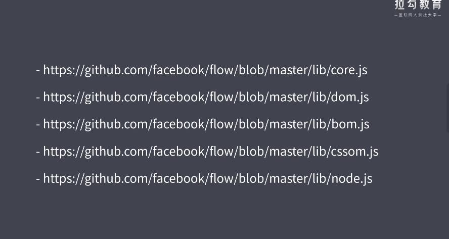

# 1. Flow   静态类型检查方案
Flow 是 JavaScirpt 的类型检查器 （react,vue中有使用到）
Flow 只是一个小工具，so Easy，TypeScript 是一门语言

Flow 如何解决 JavaScript 弱类型带来的弊端的
- 把我们编写的代码和实现生产上的代码分开，然后在中间加入了编译的环节，这种的话在开发的阶段使用一些扩展语法，使得我们的类型检测变得可能。

工作原理：
- 让我们在代码当中通过添加一些类型注解的方式来去标级我们的代码中的变量或者说是参数他应该是什么类型的，然后Flow 根据这些类型注解就可以检查代码当中是否会存在类型使用上的异常。从而去实现我们在代码开发阶段对类型的一个检查，这就避免了我们在运行阶段才发现这种类型上使用的错误。 
我们以下面的代码为例:

``` js
// : 类型的这种用法叫类型注解
function sum(a: number, b: number){
    return a + b;
}
sum(100,50);    // ok
sum(100,"50");  // error  must be a number
```

## 1.1 Flow 快速入手        https://flow.org/en/docs/install/
执行步骤
- 在项目中安装 flow-bin
- 在类型检查的文件中添加  @flow 的注释标记
- 在代码中为变量添加类型注释  :类型
``` js
// 1. 项目中安装 flow-bin
yarn add flow-bin
// 2. 初始化 .flowconfig配置文件
yarn flow init 
// 3. 执行 flow 命令 来检查当前项目中所有带 @flow 的注释标记的文件
yarn flow   
// 4. 在vsCode 里 设置中  关闭 javascript validate  不然vsCode会编译不通过
```

工作原理  
- 根据我们在代码当中添加的类型注解去找到所有类型上使用的异常

移除类型注解
``` js
// @flow

// index.js
function sum(a: number, b: number) {
    return a + b;
}
sum(1, 2);
sum("4", "2");      // 执行 yarn flow 会报错
```
通过上面这种方式我们无法直接执行当前文件，因为这种类型注解并不是JavaScript的语法，所以说我们添加这种类型注解后就会造成我们这里的代码他是没有办法去正常运行的。为了解决这种问题，我们可以自动的去移除掉这里的类型注解，这里的类型注解只是在编码阶段帮我们找出类型问题的，在实际运行中没有必要的。有两种工具可以实现<font color="red">移除类型注解</font>
1. flow-remove-types
``` js
// 1. 安装模块
yarn add flow-remove-types
// 2. 执行模块命令
yarn flow-remove-types src -d dist
```
2. @babel/preset-flow
``` js
// 1. 安装模块
yarn add @babel/core @babel/cli @babel/preset-flow
// 2. 执行模块命令
yarn babel src -d dist
```

[开发工具插件](https://flow.org/en/docs/editors/)        
- Flow Language Support     在代码中直接让flow编译不通过的代码报错

## 1.2 类型推断
根据我们代码中的使用情况来推断出变量的类型这样的一个特征就叫类型推断，更多情况下还是添加类型注解，让我们的代码更加有可读性
``` js
function square(n) {
    return n * n;    // 推断出参数必须是number类型
}
// square("10");
square(10);    
```
## 1.3 类型注解
``` js
let num: number = 100;
// num = "string";  

function foo(): number {
    return 1;
}
```

## 1.4 原始类型
``` js
// string
const a: string = "foo";

// number
const b: number = 100;
const b2: number = NaN;
const b3: number = Infinity;

// boolean
const c: boolean = true;

// null
const d: null = null;

// undefined
const e: void = undefined;

// symbol
const f: symbol = Symbol();
```

## 1.5 数组类型
``` js

// 1. 数组的声明两种方式
const arr: Array<number> = [1, 2, 3];
const arr1: number[] = [1, 2, 3];

// 2. 固定长度的类型数组  （元组）
const foo: [String, number] = ["foo", 123];
```

## 1.6 对象类型
``` js
// 1. 声明对象的属性是什么类型的
const obj1: {
    name: string,
    age: number
} = { name: "lisi", age: 20 };

// 2. 声明对象的属性可选
const obj2: {
    name: string,
    age?: number    // 可选的变量
} = { name: "lisi" };

// 3. 声明对象的属性和值是指定类型
const obj3: { [string]: string } = {};
obj3.name = "zhangshan";
// obj3.age = 20;  // 编译报错
```

## 1.7 函数类型
限制函数的参数和函数的返回值类型
``` js
// sum的参数和返回值都是number类型
function sum(a: number, b: number): number {
    return a + b;
}
console.log(sum(1, 2));

// foo的参数是函数，并且此函数的参数是string和number类型，返回值类型为undefined
function foo(callback: (string, number) => void) {
    callback("abc", 100);
}
foo(function (str, num) {
    console.log(str, num);
});
```

## 1.8 特殊类型
```js
// 1. 字面量类型
const a: "foo" = "foo";

// 2. 字面量类型+或类型
const type: "success" | "warning" | "danger" = "success";

// 3. 声明一个既是string和number类型
type stringOrNumber = string | number;

const b: stringOrNumber = "string";    // 100

// 4. ?可选类型可以为null和undefined  
const gener1: ?number = null;   // undefined, 100
// 上面这种类型相当于下面的类型
const gener3: number | null | undefined = undefined; 
```

## 1.9 Mixed 与 any
mixed类型
- 是所有类型的联合类型
``` js
function passMixed(value: mixed) {
    // value * value;  // 编译上会报错
    if (typeof value === "number") {
        value * value;
    }

}
passMixed("string");
passMixed(null);
```
any类型
- 是所有类型的联合类型
``` js
function passAny(value: any) {
    value * value;      // 语法上不会报错
}
passAny("string");
passAny(null);
```

mixed类型和any类型的差异
- any是弱类型，mixed是强类型的
- 尽量使用mixed类型，不使用any类型，any类型是为了兼容一些老的代码

## 1.10 类型小结
主要目的是在以后理解一些，例如react,vue第三方项目的源码时，这个项目当中可能遇到了flow的情况，能看懂。

[flow类型大全](https://flow.org/en/docs/types)
[第三方类型手册](https://www.saltycrane.com/cheat-sheets/flow-type/latest)

## 1.11 运行环境 API


