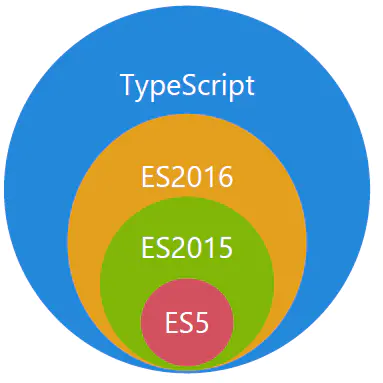

# 1. ts 的学习大纲 https://juejin.im/post/5edd8ad8f265da76fc45362c#heading-28


# 1.1 TypeScript 是什么

[TypeScript]([https://www.typescriptlang.org/) 是一种由微软开发的自由和开源的编程语言。它是 js 的一个超集，而且本质上向这个语言添加了可选的静态类型和基于类的面向对象编程。

TypeScript 提供最新的和不断发展的 JavaScript 特性，包括那些来自 2015 年的 ECMAScript 和未来的提案中的特性，比如异步功能和 Decorators，以帮助建立健壮的组件。下图显示了 TypeScript 与 ES5、ES2015 和 ES2016 之间的关系



## 1.2 ts 与 js 的区别

| TypeScript                                     | JavaScript                                 |
| ---------------------------------------------- | ------------------------------------------ |
| JavaScript 的超集用于解决大型项目的代码复杂性  | 一种脚本语言，用于创建动态网页。           |
| 可以在编译期间发现并纠正错误                   | 作为一种解释型语言，只能在运行时发现错误   |
| 强类型，支持静态和动态类型                     | 弱类型，没有静态类型选项,只有动态类型      |
| 最终被编译成 JavaScript 代码，使浏览器可以解析 | 可以直接在浏览器中使用                     |
| 支持模块、泛型和接口                           | 不支持模块，泛型或接口                     |
| 支持 ES3，ES4，ES5 和 ES6 等                   | 不支持编译其他 ES3，ES4，ES5 或 ES6 功能   |
| 社区的支持仍在增长，而且还不是很大             | 大量的社区支持以及大量文档和解决问题的支持 |

## 1.3 ts 的使用

[线上运行的工具](https://www.typescriptlang.org/play/)

1. 安装 typescript

```js
// 全局安装
npm install -g typescript
tsc -init   // 初始化ts配置文件 tsconfig.json
tsc 1.ts    // 编译ts文件
tsc         // 编译整个目录的ts文件

// 项目中安装
npm install typescript
npm tsc -init        // 初始化ts配置文件 tsconfig.json
npm tsc 1.ts         // 编译ts文件
npm tsc              // 编译整个目录的ts文件
```

# 2. TypeScript 基础类型

## 2.1 String 类型

```js
let name: string = "bc";
```

## 2.2 Number 类型

```js
let age: number = 20;
```

## 2.3 Boolean 类型

```js
let sex1: boolean = true;
let sex2: boolean = !!1;
```

## 2.4 Null 类型和 Undefined 类型

```js
let u: undefined = undefined;
let n: null = null;
```

默认情况下 null 和 undefined 是所有类型的子类型。 就是说你可以把 null 和 undefined 赋值给 number 类型的变量。然而，如果你指定了--strictNullChecks 标记，null 只能赋值给 null 类型 和 undefined 只能赋值给 undefeind 类型 void 类型。

## 2.5 Symbol 类型

```js
let s: symbol = Symbol.for("abc");
```

## 2.6 Object 类型

## 2.7 Array 类型

```js
// Array<number>泛型语法
let array1: Array<Number> = [1, 2];

let arra2: number[] = [3, 4];
```

## 2.8 Enum 类型 (枚举类型)

### 2.8.1 数字枚举

```js
enum Direction {
  "A",  // 0
  "B",  // 1
  "C",  // 2
}
let dir: Direction = Direction.B;
console.log(dir);   // 1

```

枚举值不设置，默认情况下，会从 0 开始自动增长。换句话说，Direction.A 的值为 0，Direction.B 的值为 1，Direction.C 的值为 2。上面的枚举示例代码经过编译后会生成以下代码：

```js
"use strict";
var Direction;
(function (Direction) {
  Direction[(Direction["A"] = 0)] = "A";
  Direction[(Direction["B"] = 1)] = "B";
  Direction[(Direction["C"] = 2)] = "C";
})(Direction || (Direction = {}));
var dir = Direction.B;
console.log(dir); // 1
module.exports = {};
```

当然我们也可以设置 A 的初始值，比如：那么它就会从 4 开始自动增长。

```js
enum Direction {
  "A" = 4,  // 4
  "B",      // 5
  "C",      // 6
}
```

### 2.8.2 字符串枚举

在 TypeScript 2.4 版本，允许我们使用字符串枚举。在一个字符串枚举里，每个成员都必须用字符串字面量，或另外一个字符串枚举成员进行初始化。

```js
enum Direction {
  "A" = "A",
  "B" = "B",
  "C" = "C",
}
let dir: Direction = Direction.B;
console.log(dir);
```

以上代码对于的 ES5 代码如下：

```js
"use strict";
var Direction;
(function (Direction) {
  Direction["A"] = "A";
  Direction["B"] = "B";
  Direction["C"] = "C";
})(Direction || (Direction = {}));
var dir = Direction.B;
console.log(dir); // B
```

### 2.8.3 异构枚举

异构枚举的成员值是数字和字符串的混合：

```js
enum Enum {
  A,
  B,
  C = "C",
  D = "D",
  E = 8,
  F,
}
```

以上代码对于的 ES5 代码如下：

```js
"use strict";
var Enum;
(function (Enum) {
  Enum[(Enum["A"] = 0)] = "A";
  Enum[(Enum["B"] = 1)] = "B";
  Enum["C"] = "C";
  Enum["D"] = "D";
  Enum[(Enum["E"] = 8)] = "E";
  Enum[(Enum["F"] = 9)] = "F";
})(Enum || (Enum = {}));
```

通过观察上述生成的 ES5 代码，我们可以发现数字枚举相对字符串枚举多了 “反向映射”：

```js
console.log(Enum.A); //输出：0
console.log(Enum[0]); // 输出：A
```

## 2.9 any 类型

在 TypeScript 中，任何类型都可以被归为 any 类型。这让 any 类型成为了类型系统的顶级类型（也被称作全局超级类型）。

> 为了解决之前有些 js 代码 无法全部转换成 ts 的项目问题，ts 就出了一个 any 类型，any 类型就相当于之前 js 的弱类型语言。也就是可以随便更改类型(动态类型)

```js
let a: any = 1;
a = "123";
a = true;
a = null;
a = undefined;
a = [];
```

any 类型本质上是类型系统的一个逃逸舱。作为开发者，这给了我们很大的自由：TypeScript 允许我们对 any 类型的值执行任何操作，而无需事先执行任何形式的检查。比如：

```js
let value: any;

value.foo.bar; // OK
value.trim(); // OK
value(); // OK
new value(); // OK
value[0][1]; // OK
```

在许多场景下，这太宽松了。使用 any 类型，可以很容易地编写类型正确但在运行时有问题的代码。如果我们使用 any 类型，就无法使用 TypeScript 提供的大量的保护机制。为了解决 any 带来的问题，TypeScript 3.0 引入了 unknown 类型。

综上总结：

- 1. 任何类型都可以赋值给 any 类型
- 2. any 类型可以赋值给任何类型(编译时不会报错)
- 3. any 类型可以使用任何类型的方法(编译时不会报错,运行时看值赋值的类型是什么)

## 2.10 Unknown 类型

就像所有类型都可以赋值给 any，所有类型也都可以赋值给 unknown。这使得 unknown 成为 TypeScript 类型系统的另一种顶级类型（另一种是 any）。下面我们来看一下 unknown 类型的使用示例：

```js
let value: unknown;

value = true; // OK
value = 42; // OK
value = "Hello World"; // OK
value = []; // OK
value = {}; // OK
value = Math.random; // OK
value = null; // OK
value = undefined; // OK
value = new TypeError(); // OK
value = Symbol("type"); // OK
```

对 value 变量的所有赋值都被认为是类型正确的。但是，当我们尝试将类型为 unknown 的值赋值给其他类型的变量时会发生什么？

```js
let value: unknown;

let value1: unknown = value; // OK
let value2: any = value; // OK
let value3: boolean = value; // Error
let value4: number = value; // Error
let value5: string = value; // Error
let value6: object = value; // Error
let value7: any[] = value; // Error
let value8: Function = value; // Error
```

unknown 类型只能被赋值给 any 类型和 unknown 类型本身。直观地说，这是有道理的：只有能够保存任意类型值的容器才能保存 unknown 类型的值。毕竟我们不知道变量 value 中存储了什么类型的值。

现在让我们看看当我们尝试对类型为 unknown 的值执行操作时会发生什么。以下是我们在之前 any 章节看过的相同操作：

```js
let value: unknown;

value.foo.bar; // Error
value.trim(); // Error
value(); // Error
new value(); // Error
value[0][1]; // Error
```

将 value 变量类型设置为 unknown 后，这些操作都不再被认为是类型正确的。通过将 any 类型改变为 unknown 类型，我们已将允许所有更改的默认设置，更改为禁止任何更改。

综上总结：

- 1. 任何类型都可以赋值给 unknown 类型
- 2. unknown 类型不可以赋值给任何类型(编译时就会报错)
- 3. unknown 类型不可以使用任何类型的方法(编译时就会报错)

## 2.11 Tuple 类型 (元组类型)

众所周知，数组一般由同种类型的值组成，但有时我们需要在单个变量中存储不同类型的值，这时候我们就可以使用元组。在 JavaScript 中是没有元组的，元组是 TypeScript 中特有的类型，其工作方式类似于数组。

元组可用于定义具有有限数量的未命名属性的类型。每个属性都有一个关联的类型。使用元组时，必须提供每个属性的值。为了更直观地理解元组的概念，我们来看一个具体的例子：

```js
let tupleType: [string, boolean] = ["lisi", true];
```

在元组初始化的时候，如果出现类型不匹配的话，比如：

```js
let tupleType: [string, boolean] = [true, "lisi"];
```

此时，TypeScript 编译器会提示以下错误信息：

```js
[0]: Type 'true' is not assignable to type 'string'.
[1]: Type 'string' is not assignable to type 'boolean'.
```

在元组初始化的时候，我们还必须提供每个属性的值，不然也会出现错误，比如：

```js
let tupleType: [string, boolean] = ["lisi"];
```

此时，TypeScript 编译器会提示以下错误信息：

```js
Property '1' is missing in type '[string]' but required in type '[string, boolean]'.
```

综上总结：

- 元组可用于定义具有有限数量的未命名属性的类型。每个属性都有一个关联的类型。使用元组时，必须提供每个属性的值，不然会编译不通过
- 元组类型赋值时必须满足 2 个规则: 赋值数量和赋值的类型必须和元组类型定义的属性的类型一一对应，不然会编译报错。

## 2.12 Void 类型

某种程度上来说，void 类型像是与 any 类型相反，它表示没有任何类型。当一个函数没有返回值时，你通常会见到其返回值类型是 void：

```js
// 声明函数返回值为void
function warnUser(): void {
  console.log("This is my warning message");
}
```

以上代码编译生成的 ES5 代码如下：

```js
"use strict";
function warnUser() {
  console.log("This is my warning message");
}
```

需要注意的是，声明一个 void 类型的变量没有什么作用，因为它的值只能为 undefined 或 null：
注意： 需要在 tsconfig.json 中 配置"strictNullChecks": false 才能赋值 null

```js
let unusable1: void = undefined;
let unusable1: void = null; // 需要在tsconfig.json中 配置"strictNullChecks": false 才能赋值null
```

## 2.13 Never 类型

<font color="red">never</font> 类型表示的是那些永不存在的值的类型。 例如，<font color="red">never</font> 类型是那些总是会抛出异常或根本就不会有返回值的函数表达式或箭头函数表达式的返回值类型。

```js
// 返回never的函数必须存在无法达到的终点
function error(message: string): never {
  throw new Error(message);
}

// 死循环
function infiniteLoop(): never {
  while (true) {}
}
```

在 TypeScript 中，可以利用 never 类型的特性来实现全面性检查，具体示例如下：

```js
type Foo = string | number;

function controlFlowAnalysisWithNever(foo: Foo) {
  if (typeof foo === "string") {
    // 这里 foo 被收窄为 string 类型
  } else if (typeof foo === "number") {
    // 这里 foo 被收窄为 number 类型
  } else {
    // foo 在这里是 never
    const check: never = foo;
  }
}
```

注意在 else 分支里面，我们把收窄为 never 的 foo 赋值给一个显示声明的 never 变量。如果一切逻辑正确，那么这里应该能够编译通过。但是假如后来有一天你的同事修改了 Foo 的类型：

```js
type Foo = string | number | boolean;
```

然而他忘记同时修改 <font color="red"> controlFlowAnalysisWithNever </font>方法中的控制流程，这时候 else 分支的 foo 类型会被收窄为 <font color="red"> boolean </font> 类型，导致无法赋值给 never 类型，这时就会产生一个编译错误。通过这个方式，我们可以确保

<font color="red">controlFlowAnalysisWithNever </font> 方法总是穷尽了 Foo 的所有可能类型。 通过这个示例，我们可以得出一个结论： <font color="black" size=3> 使用 never 避免出现新增了联合类型没有对应的实现，目的就是写出类型绝对安全的代码。</font>

# 3. TypeScript 断言

有时候你会遇到这样的情况，你会比 TypeScript 更了解某个值的详细信息。通常这会发生在你清楚地知道一个实体具有比它现有类型更确切的类型。

通过类型断言这种方式可以告诉编译器，“相信我，我知道自己在干什么”。类型断言好比其他语言里的类型转换，但是不进行特殊的数据检查和解构。它没有运行时的影响，只是在编译阶段起作用。

类型断言有两种形式：

## 3.1 “尖括号” 语法

```js
let someValue: any = "this is a string";
let strLength: number = (<string>someValue).length;
```

## 3.2 as 语法

```js
let someValue: any = "this is a string";
let strLength: number = (someValue as string).length;
```

# 4. 函数类型

## 4.1 ts 函数 和 js 函数的区别

| TypeScript     | JavaScript         |
| -------------- | ------------------ |
| 含有类型       | 无类型             |
| 箭头函数       | 箭头函数（ES2015） |
| 函数类型       | 无函数类型         |
| 必填和可选参数 | 所有参数都是可选的 |
| 默认参数       | 默认参数           |
| 剩余参数       | 剩余参数           |
| 函数重载       | 无函数重载         |

## 4.2 参数类型和返回类型

```js
function createUserId(name: string, id: number): string {
  return name + id;
}
```

## 4.3 函数类型

```js
let IdGenerator: (chars: string, nums: number) => string;

function createUserId(name: string, id: number): string {
  return name + id;
}

IdGenerator = createUserId;
```

## 4.3 可选参数及默认参数

```js
// 可选参数
// 参数名前面带有?关键词，代表这个参数可传可不传
// 可选参数必须放在最后面
function createUserId1(name: string, id: number, age?: number): string {
  return name + id;
}

console.log(createUserId1("id", 1, 20));
console.log(createUserId1("id", 1));

// 默认参数
// 如果最后一个为使用了默认参数，相当于可选参数可传可不传
function createUserId2(name: string, id: number, age: number = 20): string {
  return name + id;
}
console.log(createUserId2("id", 1, 20));
console.log(createUserId2("id", 1));
```

在声明函数时，可以通过 ? 号来定义可选参数，比如 age?: number 这种形式。在实际使用时，需要注意的是可选参数要放在普通参数的后面，不然会导致编译错误。(在函数体里面取参数是按照顺序取的，如果你把可选参数放在前面，就会导致参数取的时候有问题。)

## 4.4 函数重载

### 4.4.1 函数重载

函数重载或方法重载是使用相同名称和不同参数数量或类型创建多个方法的一种能力。要解决前面遇到的问题，方法就是为同一个函数提供多个函数类型定义来进行函数重载，编译器会根据这个列表去处理函数的调用。

```js
function add(a: number, b: number): number;
function add(a: string, b: string): string;
function add(a: string, b: number): string;
function add(a: number, b: string): string;
function add(a: any, b: any) {
  if (typeof a === "string" || typeof b === "string") {
    return a.toString() + b.toString();
  }
  return a + b;
}

```

在以上代码中，我们为 add 函数提供了多个函数类型定义，从而实现函数的重载。之后，可恶的错误消息又消失了，因为这时 result 变量的类型是 string 类型。在 TypeScript 中除了可以重载普通函数之外，我们还可以重载类中的成员方法。

### 4.4.2 方法重载

方法重载是指在同一个类中方法同名，参数不同（参数类型不同、参数个数不同或参数个数相同时参数的先后顺序不同），调用时根据实参的形式，选择与它匹配的方法执行操作的一种技术。所以类中成员方法满足重载的条件是：在同一个类中，方法名相同且参数列表不同。下面我们来举一个成员方法重载的例子：

```js
// 4.3 函数重载
class Calculator {
  add(a: number, b: number): number;
  add(a: string, b: string): string;
  add(a: string, b: number): string;
  add(a: number, b: string): string;
  add(a: any, b: any) {
    if (typeof a === "string" || typeof b === "string") {
      return a.toString() + b.toString();
    }
    return a + b;
  }
}
const calculator = new Calculator();
console.log(calculator.add(20, 20));
console.log(calculator.add("Semlinker", " Kakuqo"));
console.log(calculator.add("Semlinker ", 20));
console.log(calculator.add(20, " Semlinker"));
```

这里需要注意的是，当 TypeScript 编译器处理函数重载时，它会查找重载列表，尝试使用第一个重载定义。 如果匹配的话就使用这个。 因此，在定义重载的时候，一定要把最精确的定义放在最前面。另外在 Calculator 类中，add(a: Combinable, b: Combinable){ } 并不是重载列表的一部分，因此对于 add 成员方法来说，我们只定义了四个重载方法。
