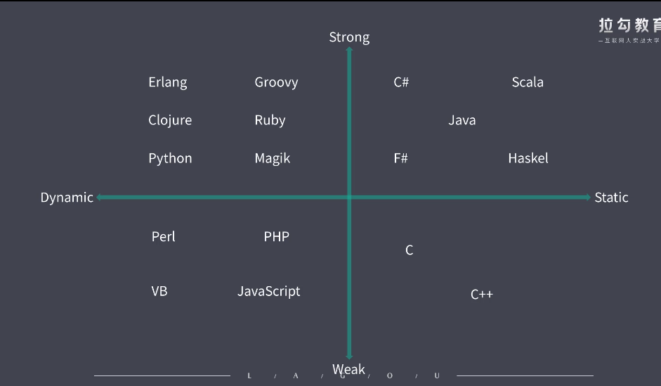

# 1. TypeScript

解决 JavaScript 类型系统的问题，提高代码的可靠程度。TypeScript是一门语言，它是最终的解决方案

# 2 强类型与弱类型  (类型安全)
强类型语言层面限制函数的实参类型必须与形参类型相同    (如java .net) 语言的语法层面，也就是编译阶段就会报错
``` js
// java 类 
class Main(){
    // 静态方法     num是int类型
    static void foo(int num){
        System.err.print(num);
    }
    // 入口方法
    public static void main(String [] args){
        Main.foo(100);  // ok
        Main.foo("100");    // error "100" is a string
        Main.foo(Integer.parseInt("100"));    // ok
    }
}
```
弱类型语言层面不会限制实参的类型        (如 JavaScript) 语言的语法层面，也就是编译阶段不会报错
``` js
function foo(num){
    console.log(num);
}
foo(100);   // ok
foo("100"); // ok
foo(parseInt("100"));   // ok
```
通过上述得出以下结论
- 强类型有更强的类型约束，而弱类型中几乎没有什么约束
- 强类型语言中不允许任意的隐式类型转换
- 强类型不允许随意的隐式类型转换，而弱类型是允许的
- 变量类型允许随时改变的特点，不是强弱类型的差异    (Python，有人说是一门弱类型语言，其实不是的)


# 3 静态类型与动态类型  (类型检查)
静态类型    Java, .net
- 一个变量声明时它的类型就是明确的
- 声明过后，它的类型就不允许再修改

动态类型        JavaScript
- 运行阶段才能够明确变量类型
- 而且变量的类型随时可以改变
- 动态类型语言中的变量没有类型，变量中存放的值是有类型的
``` js
var foo = 123;
foo = "bar";    // ok
consoel.log(foo);   // bar
```

# 4. 强类型与弱类型的区别   (类型安全)
是否允许随意的隐式类型转换
# 5. 静态类型与动态类型的区别   (类型检查)
是否允许随意去修改变量的类型

# 6. 常见的变成语言在类型安全和类型检查两个角度的表现


- 通过上述可知 JavaScript通过类型安全角度可以分为弱类型，类型检查的角度可以分为动态类型
- 注意： 不要混淆了类型安全和类型检查这两个区分维度，更不要认为弱类型就是动态类型，强类型就是静态类型，这种说法是安全不正确的。

# 7. JavaScript 类型系统特征
弱类型 并且 动态类型

缺点: 没有任何的类型限制(任性)，这种灵活类型多变的背后，缺失了类型系统的可靠性。

通过上面引出了为什么JavaScript不设计为 强类型 / 静态类型了
- 早前的 JavaScript 应用简单，不会想到会发展到今天这种的规模。
- JavaScript 没有编译环节。   设计成静态类型也没有什么意义，因为静态类型需要在编译环节做类型检查
- 根据以上原因所以 JavaScript设计成为 弱类型 / 动态类型
- 大规模应用下，这种 (弱类型 / 动态类型)的优势 就变成了短板

# 8 JavaScript 自有类型系统的问题
## 8.1 弱类型的问题
``` js
const obj = {};
// 1. 这样一个隐患就会留在我们代码中
// obj.foo();  // 编译不会报错，运行的时候会报错
// setTimeout(() => {
//     obj.foo();
// }, 100000);

// 2. 问题2
function sum(a, b) {
    return a + b;
}
console.log(sum(1, 1));     // 2
console.log(sum(1, "1"));   // "11"

// 3. 问题3
const obj1 = {};
obj1[true] = 100;
console.log(obj1["true"]);  // 100
```
通过以上代码我们总结出弱类型语言的问题
- 类型异常需要我们等到运行时才会发现
- 类型不明确可能会造成我们函数的功能会发生改变
- 导致我们对对象的索引器的错误用法

## 8.2 强类型的优势
一、错误更早暴露
- 编码阶段提前去消灭一大部分可能存在的类型异常，因为在编码阶段语言本身就会把它暴露出来，就不会等待在运行阶段在查找这些错误。

二、代码更智能，编码更准确      
- 智能提示: 能有效提高我们的编码效率和编码的准确性。
``` js
// 在这种情况下，程序不知道element是什么类型，所以没有智能提示，容易导致单词拼错
function render(element) {
    element.className = "class1";
    // innerHTML
    element.innerHtml = "hi ";
}
```

三、重构更牢靠
``` js
// 弱类型语言中，我们想修改这个a的变量名，但是有好多地方都用到了，就不敢轻易去修改，因为程序在编译阶段不不会报错，只有在运行时报错。
const util = {
    a: () => {
        console.log("util func");
    }
}
```
上述如果是强类型语言的话，一旦你对象的属性名发生了变化，我们在重新编译时就会立即报出错误，这种就可以轻松定位所有使用这个成员的地方。然后把他们修改过来，甚至有些工具还能自动把所有引用到这个对象的成员的地方自动给修改过来。非常方便

四、减少不必要的类型判断
``` js
function sum(a, b) {
    // 弱类型语言需要我们自己判断是否是我们需要的类型，如果是强类型语言不是我们需要的类型根本就不会进来，就不需要这段代码去判断类型了
    if (typeof a !== "number" || typeof b !== "number") {
        throw new TypeError("arguments must be a number");
    }
    return a + b;
}
```

# 9 Flow [静态类型检查方案]("./task2-flow.md")

# 10 [TypeScript]("./task1ECMAScript新特性.md") 语言规范与基本应用
