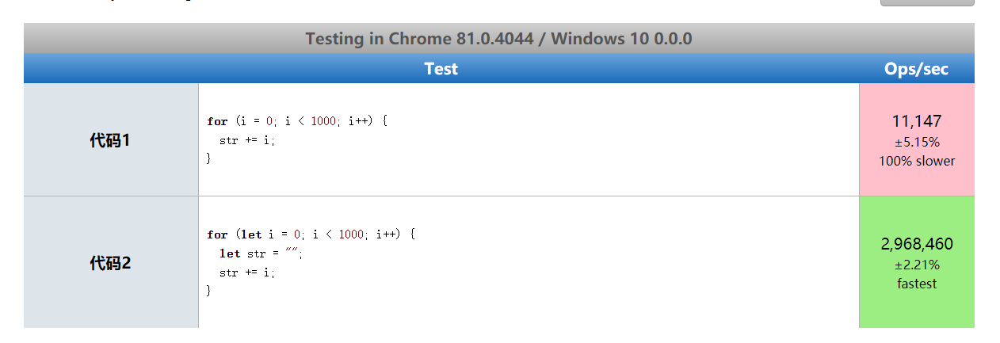
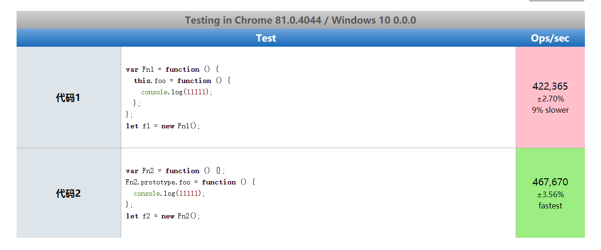
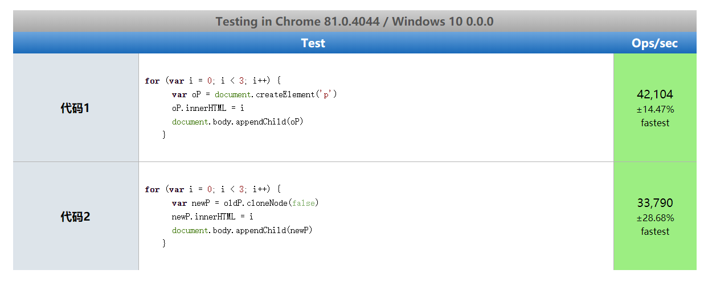
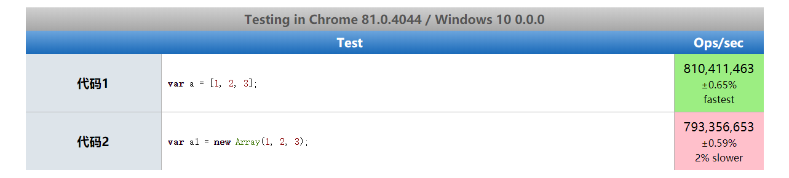
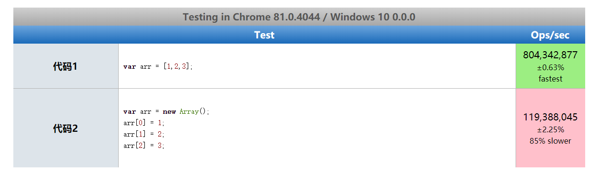

# 1. JavaScript 性能优化

为什么要性能优化

-

性能优化介绍

- 性能优化是不可避免的
- 哪些内容可以看作是性能优化
- 无处不在的前端性能优化

通过这篇文章知道如何编写高性能的 JavaScript

## 1.2 内存管理 (Memory Management)

内存为什么要管理

内存管理介绍

- 内存： 由可读写单元组成，表示一片可操作空间
- 管理： 人为的去操作一片空间的申请、使用和释放
- 内存管理：开发者主动申请空间、使用空间、释放空间
- 管理流程：申请——使用——释放

JavaScript 中的内存管理

- 申请内存空间
- 使用内存空间
- 释放内存空间

## 1.3 垃圾回收与 常见 GC 算法

### 1.3.1 垃圾回收

JavaScript 中的垃圾

- JavaSript 中内存管理是自动的
- 对象不再被引用的垃圾
- 对象不能从根上访问到时是垃圾

JavaScript 中的可达对象

- 可以访问到的对象就是可达对象 (引用、作用域链)
- 可达的标准就是从根出发是否能够被找到
- JavaScript 中的根就可以理解为是全局变量对象

JavaScript 中的引用与可达

### 1.3.2 GC 算法

#### 1.3.2.1 GC 算法的介绍

GC 定义与作用

- GC 就是垃圾回收机制的简写
- GC 可以找到内存中的垃圾、并释放和回收空间

GC 里的垃圾是什么

- 程序中不再需要使用的对象
- 程序中不能再访问到的对象

GC 算法是什么

- GC 是一种机制，垃圾回收器完成具体的工作
- 工作的内容就是查找垃圾释放空间、回收空间
- 算法就是工作时查找和回收所遵循的规则

### 1.3.2.2 常见 GC 算法

#### 1.3.2.2.1 引用计数

#### 1.3.2.2.2 标记清除

#### 1.3.2.2.3 标记整理

#### 1.3.2.2.4 分代回收

## 1.4 V8 引擎的垃圾回收

## 1.5 Performance 工具

## 1.6 代码优化案例

代码为什么需要优化

- WEB 应用日益丰富，用户体验至关重要，前端性能备受关注
- 实现相同结果下，哪种类型 JavaScript 代码具有更高性能
- 高性能的背后是数据快速存取，也是优秀内存管理的体现

如何精确测试 JavaScript 性能

- 本质上就是采集大量的执行样本进行数学统计和分析
- 使用基于 Benchmark.js 的 https://jsperf.com/ 完成

Jsperf 使用流程

- 使用 GitHub 账号登录
- 填写个人信息 (非必填)
- 填写详细的测试用例信息 (title、slug)
- 填写准备代码 (DOM 操作时经常使用)
- 填写必要有 setup 与 teardown 代码
- 填写测试代码片段

### 1.6.1 慎用全局变量

为什么要慎用

- 全局变量定义在全局执行上下文中，是所有作用域链的顶端
- 全局执行上下文一直存在于上下文执行栈中，知道程序退出
- 如果莫个局部作用域出现了同名变量则会遮蔽或污染全局变量
- 明确数据作用域的情况下，尽量用局部变量

```js
// 1. 在方法里面使用全局变量
function fn1() {
  name = "lisi";
  console.log(`hello ${name}`);
}
fn1();

// 2. 使用局部变量
function fn2() {
  const name = "lisi";
  console.log(`hello ${name}`);
}
fn2();
```


综上所得，乱使用全局变量比使用局部变量更耗性能 (尽量使用局部变量，少使用全局变量)

### 1.6.2 缓存全局变量

将使用中无法避免的全局变量缓存到局部

```js
// 1.使用全局变量
var i,
  str = "";
for (i = 0; i < 1000; i++) {
  str += i;
}

// 2. 缓存全局变量
for (let i = 0; i < 1000; i++) {
  let str = "";
  str += i;
}
```



有时候避免不了全局变量，就缓存全局变量比使用全局变量性能更高

### 1.6.3 通过原型新增方法

在原型对象上新增实例对象所需的方法

```js
// 1. 在构造函数的实例上添加方法
var Fn1 = function () {
  this.foo = function () {
    console.log(11111);
  };
};
let f1 = new Fn1();

// 2. 在构造函数的原型上添加方法
var Fn2 = function () {};
Fn2.prototype.foo = function () {
  console.log(11111);
};
let f2 = new Fn2();
```



综上所得在构造函数的原型上添加方法比在实例上添加方法性能更优

### 1.6.4 避开闭包陷阱

关于闭包

- 闭包是一种强大的语法
- 闭包使用不当容易出现内存泄漏
- 不要为了闭包而闭包

### 1.6.5 避免属性访问方法使用

JavaScript 中的面向对象

- JS 不需属性的访问方法，所有属性都是外部可见的
- 使用属性访问方法只会增加一层定义，没有访问的控制力

```js
// 添加属性访问操作
function Person1() {
  this.name = "lisi";
  this.age = 18;
  this.getAge = function () {
    return this.age;
  };
}

const p1 = new Person1();
const a = p1.getAge();

// 直接访问属性操作
function Person2() {
  this.name = "lsi";
  this.age = 18;
}
const p2 = new Person2();
const b = p2.age;
```


通过图示所得直接访问属性比不使用属性访问的方式性能高 (没有必要就不要使用属性访问方法)

### 1.6.6 for 循环优化

### 1.6.7 采用最优循环方式

### 1.6.8 节点添加优化

节点的添加操作必然会有回流和重绘，为了避免重复添加 dom，使用文档碎片添加 dom 节点

```js
// 性能低
// 要执行10次添加dom操作
for (var i = 0; i < 10; i++) {
  var oP = document.createElement("p");
  oP.innerHTML = i;
  document.body.appendChild(oP);
}
// 性能高
// 利用文档碎片节点，使n次添加dom操作变成只添加一次
const fragEle = document.createDocumentFragment();
for (var i = 0; i < 10; i++) {
  var oP = document.createElement("p");
  oP.innerHTML = i;
  fragEle.appendChild(oP);
}
// 最后才将文档碎片节点添加到body中
document.body.appendChild(fragEle);
```


通过图示所得使用文档碎片添加多个 dom 元素，最后一次性添加文档碎片节点，比一次一次的添加 dom 节点性能高

### 1.6.9 克隆优化节点操作

```html
<body>
  <p id="box1">old</p>

  <script>
    // 直接添加节点
    for (var i = 0; i < 3; i++) {
      var oP = document.createElement("p");
      oP.innerHTML = i;
      document.body.appendChild(oP);
    }

    // 通过克隆节点添加对象 将克隆对象的样式不需要重新渲染了
    var oldP = document.getElementById("box1");
    for (var i = 0; i < 3; i++) {
      var newP = oldP.cloneNode(false);
      newP.innerHTML = i;
      document.body.appendChild(newP);
    }
  </script>
</body>
```



通过图示所得通过克隆 dom 节点添加 dom 节点比添加新的节点性能高

### 1.6.10 直接量替换 Object 操作

```js
var a = [1, 2, 3]; // 性能高
var a1 = new Array(1, 2, 3);
```




通过图示所得对象直接量比实例化对象的性能高
