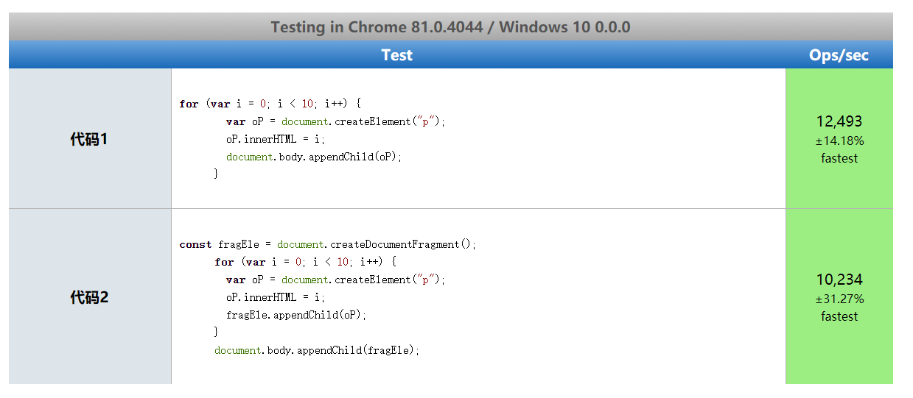

# 1. JavaScript 性能优化

性能优化介绍

- 性能优化是不可避免的
- 哪些内容可以看作是性能优化
  - 本质上任何一种可以提高运行效率，降低运行开销的行为都可以看做是优化操作
- 无处不在的前端性能优化
  - 请求资源时所用到的网络
  - 数据的传输方式
  - 开发中所使用的框架等

通过这篇文章探索 JavaScript 语言的优化

> 从认知内存空间的使用，再到垃圾回收的方式介绍，从而让我们编写出搞笑的 JavaScript 代码

## 1.2 内存管理 (Memory Management)

为什么内存要管理


我们写代码时不够了解内存管理的一些机制，从而让我们去编写出一些不容易察觉的内存问题性代码，像这种代码多了以后，给我们程序代码的是意想不到的 bug，所以掌握内存管理还是有必要的。(上述代码就是内存泄漏了)

现实中的内存管理介绍

- 内存： 由可读写单元组成，表示一片可操作空间
- 管理： 人为的去操作一片空间的申请、使用和释放
- 内存管理：开发者主动申请空间、使用空间、释放空间
- 管理流程：申请——使用——释放

JavaScript 中的内存管理

- 申请内存空间
- 使用内存空间
- 释放内存空间

## 1.3 垃圾回收与 常见 GC 算法

### 1.3.1 垃圾回收

JavaScript 中的垃圾

- JavaSript 中内存管理是自动的 (创建变量和函数时会自动分配空间)
- 对象不再被引用的垃圾
- 对象不能从根上访问到时是垃圾
- 总结： 对象不被引用，并且不能从根上访问到时就是垃圾

JavaScript 中的可达对象

- 可以访问到的对象就是可达对象 (引用、作用域链)
- 可达的标准就是从根出发是否能够被找到
- JavaScript 中的根就可以理解为是全局变量对象

JavaScript 中的垃圾回收其实就是找到垃圾，然后让 JavaScript 中的执行引擎来进行空间的释放和回收

JavaScript 中的引用与可达

- js 的引用

```js
// js 的引用
let obj = { name: "lisi" }; // obj 就是可达对象
let obj2 = obj;
obj = null; // 执行完之后 obj还是可达的对象，因为obj2引用了obj
```

- js 的可达

```js
function objGrop(obj1, obj2) {
  obj1.next = obj2;
  obj2.prev = obj1;
  return {
    obj1,
    obj2,
  };
}
let obj = objGrop({ name: "obj1" }, { name: "obj2" });
console.log(obj);
// {
// obj1: { name: 'obj1', next: { name: 'obj2', prev: [Circular] } },
// obj2: { name: 'obj2', prev: { name: 'obj1', next: [Circular] } }
// }
```


### 1.3.2 GC 算法

#### 1.3.2.1 GC 算法的介绍

GC 定义与作用

- GC 就是垃圾回收机制的简写
- GC 可以找到内存中的垃圾、并释放和回收空间

GC 里的垃圾是什么

- 程序中不再需要使用的对象

```js
function fn() {
  name = "lisi";
  return `hello ${name}`;
}
fn();
// 执行完之后name不需要使用了
```

- 程序中不能再访问到的对象

```js
function fn() {
  const name = "lisi";
  return `hello ${name}`;
}
fn();
// 执行完之后name属性在外面访问不到
```

GC 算法是什么

- GC 是一种机制，垃圾回收器完成具体的工作
- 工作的内容就是查找垃圾释放空间、回收空间
- 算法就是工作时查找和回收所遵循的规则

### 1.3.2.2 常见 GC 算法

#### 1.3.2.2.1 引用计数

引用计数算法

- 核心思想：设置引用数，判断当前引用数是否为 0 来决定它是不是一个垃圾对象，当这个数为 0 的时候 GC 就开始工作，将其所在的内存空间进行回收释放再使用。
- 引用计数器
  - 引用关系改变时引用计数器就会去修改对应的引用数值
- 引用数值为 0 时 GC 立即回收

```js
const obj1 = { age: 18 };
const obj2 = { age: 19 };
const obj3 = { age: 20 };
const ageList = [obj1.age, obj2.age, obj3.age];
function fn() {
  // 代码执行到这里的时候，这里的num1和num2引用数值为1
  const num1 = 1;
  const num2 = 2;
}
fn();
// 当fn()代码执行完，num1和num2的引用数值为0，GC就会回收num1和num2
```

引用计数算法优点

- 发现垃圾时立即回收
  - 根据当前对象的引用数值是否为 0 判断是不是一个垃圾，如果找到了就立即释放
- 最大限度减少程序暂停
  - 因为引用计算算法是时刻监控着引用数值为 0 的对象，当他发现这个内存即将饱满的时候，引用计数会立即找到引用数值为 0 的对象去立即释放。这就保证了当前内存不会有占满的时候，这就是所谓的最大限度减少程序暂停。

引用计数算法缺点

- 无法回收循环引用的对象

```js
function fn() {
  // fn执行完后，在这里全局里找不到obj1和obj2，这里的引用数值为0
  const obj1 = {};
  const obj2 = {};
  // 但是,在这里obj1和obj2互相引用了,所以它们的引用数值就不为0了
  obj1.name = obj2;
  obj2.name = obj1;
}
fn();
```

- 时间开销大
  - 因为我们当前的引用计数他需要取维护一个数值的变化，他在这种情况下要时刻去监控当前对象的引用数值是否需要修改，本身这个引用数值的修改就需要消耗时间，如果这个内存里面有更多的内存去修改，那么这个时间就会显得更大些

#### 1.3.2.2.2 标记清除

标记清除算法

- 核心思想： 分标记和清除二个阶段完成
  - 阶段一： 遍历所有对象找标记活动对象 (和可达对象是一个道理)
  - 阶段二： 遍历所有对象清除没有标记对象 (会把第一个阶段设置的标记抹掉，便于 GC 下次能正常工作)
- 回收相应的空间放到空闲列表上面，方便后面的程序直接在这里申请空间的使用

标记清除算法图示如下:


标记清除算法优点

- 可以解决(引用计数算法来说)对象循环引用的回收操作

标记清除算法缺点

- 容易产生空间碎片化，浪费空间 (地址不连续造成的)
  - 由于我们当前回收的垃圾对象在地址上他本身是不连续的，由于这种不联系从而造成我们回收之后他们分散在个个角落，那后续我们想去使用的使用，如果刚好巧了新的生成空间和他的大小匹配，就能直接用，一旦是多了还是少了我们就不太适合使用了。这就是空间碎片化
- 不会立即回收垃圾对象
  - 遍历中发现对象是不可达的，他不会立即清楚，要等最后才会清楚。
- 他在清楚的时候程序是停止工作的

- 空间碎片化如下图所示
  

#### 1.3.2.2.3 标记整理

- 标记整理可以看做是标记清除的增强
  - 标记阶段的操作和标记清除算法的标记阶段一致
  - 清除阶段会先执行整理，移动对象位置，让他们能够在地址上面产生连续
  - 整理的是将活动对象进行移动，在地址上变成连续的位置，紧接着将不活动的对象进行回收。

标记整理算法的图示

- 回收前的图示
  
- 整理后的图示
  
- 回收后的图示
  

标记整理优点

- 减少碎片化空间
  标记整理缺点
- 不会立即回收垃圾对象

## 1.4 V8 引擎的垃圾回收

认识 V8

- V8 是一款主流的 JavaScript 执行引擎
- V8 他的速度很快 (采用了即时编译)
  - 之前 js 引擎大多数都是将我们的源代码转成字节码然后再执行， 而 V8 将源码直接翻译成可执行的机器码，所以这个时候的速度是非常快的
- V8 内存设限
  - 64 位的操作系统不超过 1.5G
  - 32 位的操作系统不超过 800MB
  - 为什么采用这种的做法了：
    - 原因: 1. V8 本身就是为了浏览器制造的，所以现在的内存大小对网页引用来说是足够使用的，再有 V8 内部实现的垃圾回收机制也决定了他采用这种的设置是非常合理的。因为官方去做过这样的测试，当我们的垃圾内存达到 1.5G 的时候如果 V8 采用增强标记的算法进行垃圾回收只需要消耗 50ms,而采用非增量标记回收则需要 1s,从用户体验来说 1s 相当于很长的时间了，所以在这里他就以 1.5G 为界限了。

V8 垃圾回收策略

- 采用分代回收的思想
- 内存分为新生代、老生代对象
- 针对不同对象采用不同算法

V8 垃圾回收策略图示:


V8 中常用 GC 算法

- 分代回收
- 空间复制
- 标记清除
- 标记整理
- 标记增量

### 1.4.1 V8 如何回收新生代对象

V8 内存分配


- V8 内存空间一分为二
- 小空间用于存储新生代对象 (32M | 16M)
- 新生代指的是存活时间较短的对象 (例如：局部对象)

新生代对象回收实现

- 回收过程采用复制算法 + 标记整理
- 新生代内存区分为两个等大小空间
- 使用空间为 From，空闲空间为 To
- 活动对象存储于 From 空间
- 标记整理后将活动对象拷贝至 To
- From 于 To 交换空间完成释放

回收细节说明

- 拷贝过程中可能出现晋升
- 晋升就是将新生代对象移动至老生代
- 一轮 GC 还存活的新生代需要晋升
- To 空间的使用率超过 25%

### 1.4.2 V8 如何回收老生代对象

老生代对象说明

- 老生代对象存放在右侧老生代区域
- 64 操作系统 1.4G，32 操作系统 700M
- 老生代对象就是指存活时间较长的对象

老生代对象回收实现

- 主要采用标记清除、标记整理、增量标记算法
- 首先使用标记清除完成垃圾的回收
- 采用标记整理进行空间优化
- 采用增量标记进行效率优化

细节对比

- 新生代区域垃圾回收使用空间换时间
- 老生代区域垃圾回收不适合复制算法

标记增量如何优化垃圾回收


V8 垃圾回收总结

- V8 是一款主流的 JavaScript 执行引擎
- V8 内存设置上线
- V8 采用基于分代回收思想实现垃圾回收
- V8 内存分为新生代和老生代
- V8 垃圾回收常见的 GC 算法

## 1.5 Performance 工具

为什么使用 Performance 工具

- GC 的目的是为了实现内存空间的良性循环
- 良性循环的基石是合理使用
- 时刻关注才能确定是否合理
- Performance 提供多种监控方式
- 通过 Performance 时刻监控内存

Performance 使用步骤

- 打开浏览器输入目标网址
- 打开开发人员工具面板，选择性能
- 开启录制功能，访问具体页面
- 执行用户行为，一段时间后停止录制
- 分析页面中记录的内存信息

内存问题的体现

- 页面出现延迟加载或经常性暂停
- 页面持续性出现糟糕的性能
- 页面的性能随时间延长越来越差

界定内存问题的标准

- 内存泄漏：内存使用持续升高
- 内存膨胀：在多数设备上都存在性能问题
- 频繁垃圾回收：通过内存变化图进行分析

监控内存的几种方式

- 浏览器任务管理器
  - shift+esc 调用浏览器的任务管理器
- Timeline 时序图记录
- 堆快照查找分离 DOM

  - 工作原理：找到当前的 JS 堆，进行一个照片的留存，找到分离 DOM 并删除
  - 垃圾 DOM：从 DOM 树上脱离且没有被引用
  - 分离 DOM：从 DOM 树上脱离但是在 JS 代码中仍然被引用

什么是分离 DOM

- 页面元素存在在 DOM 树上
- 垃圾对象时的 DOM 节点
- 分离状态的 DOM 节点

为什么确定频繁垃圾回收

- GC 工作时应用程序是停止的
- 频繁且过长的 GC 会导致应用假死
- 用户使用中感知应用卡顿

判断是否存在频繁的垃圾回收

- Timeline 中频繁上升下降，
- 任务管理器中数据频繁地增加减少

Performance 总结

- Performance 使用流程
- 内存问题的相关分析
- Performance 时序图监控内存变化
- 任务管理器监控内存变化
- 堆块照查找分离 DOM
- 总结：Chrome 提供的工具，通过使用该工具可以监控程序对内存的使用，以发现内存使用的问题并优化程序

## 1.6 代码优化案例

代码为什么需要优化

- WEB 应用日益丰富，用户体验至关重要，前端性能备受关注
- 实现相同结果下，哪种类型 JavaScript 代码具有更高性能
- 高性能的背后是数据快速存取，也是优秀内存管理的体现

如何精确测试 JavaScript 性能

- 本质上就是采集大量的执行样本进行数学统计和分析
- 使用基于 Benchmark.js 的 https://jsperf.com/ 完成

Jsperf 使用流程

- 使用 GitHub 账号登录
- 填写个人信息 (非必填)
- 填写详细的测试用例信息 (title、slug)
- 填写准备代码 (DOM 操作时经常使用)
- 填写必要有 setup 与 teardown 代码
- 填写测试代码片段

### 1.6.1 慎用全局变量

为什么要慎用

- 全局变量定义在全局执行上下文中，是所有作用域链的顶端
- 全局执行上下文一直存在于上下文执行栈中，知道程序退出
- 如果莫个局部作用域出现了同名变量则会遮蔽或污染全局变量
- 明确数据作用域的情况下，尽量用局部变量

```js
// 1. 在方法里面使用全局变量
function fn1() {
  name = "lisi";
  console.log(`hello ${name}`);
}
fn1();

// 2. 使用局部变量
function fn2() {
  const name = "lisi";
  console.log(`hello ${name}`);
}
fn2();
```


综上所得，乱使用全局变量比使用局部变量更耗性能 (尽量使用局部变量，少使用全局变量)

### 1.6.2 缓存全局变量

将使用中无法避免的全局变量缓存到局部

```js
// 1.使用全局变量
var i,
  str = "";
for (i = 0; i < 1000; i++) {
  str += i;
}

// 2. 缓存全局变量
for (let i = 0; i < 1000; i++) {
  let str = "";
  str += i;
}
```


有时候避免不了全局变量，就缓存全局变量比使用全局变量性能更高

### 1.6.3 通过原型新增方法

在原型对象上新增实例对象所需的方法

```js
// 1. 在构造函数的实例上添加方法
var Fn1 = function () {
  this.foo = function () {
    console.log(11111);
  };
};
let f1 = new Fn1();

// 2. 在构造函数的原型上添加方法
var Fn2 = function () {};
Fn2.prototype.foo = function () {
  console.log(11111);
};
let f2 = new Fn2();
```


综上所得在构造函数的原型上添加方法比在实例上添加方法性能更优

### 1.6.4 避开闭包陷阱

关于闭包

- 闭包是一种强大的语法
- 闭包使用不当容易出现内存泄漏
- 不要为了闭包而闭包

### 1.6.5 避免属性访问方法使用

JavaScript 中的面向对象

- JS 不需属性的访问方法，所有属性都是外部可见的
- 使用属性访问方法只会增加一层定义，没有访问的控制力

```js
// 添加属性访问操作
function Person1() {
  this.name = "lisi";
  this.age = 18;
  this.getAge = function () {
    return this.age;
  };
}

const p1 = new Person1();
const a = p1.getAge();

// 直接访问属性操作
function Person2() {
  this.name = "lsi";
  this.age = 18;
}
const p2 = new Person2();
const b = p2.age;
```


通过图示所得直接访问属性比不使用属性访问的方式性能高 (没有必要就不要使用属性访问方法)

### 1.6.6 for 循环优化

### 1.6.7 采用最优循环方式

### 1.6.8 节点添加优化

节点的添加操作必然会有回流和重绘，为了避免重复添加 dom，使用文档碎片添加 dom 节点

```js
// 性能低
// 要执行10次添加dom操作
for (var i = 0; i < 10; i++) {
  var oP = document.createElement("p");
  oP.innerHTML = i;
  document.body.appendChild(oP);
}
// 性能高
// 利用文档碎片节点，使n次添加dom操作变成只添加一次
const fragEle = document.createDocumentFragment();
for (var i = 0; i < 10; i++) {
  var oP = document.createElement("p");
  oP.innerHTML = i;
  fragEle.appendChild(oP);
}
// 最后才将文档碎片节点添加到body中
document.body.appendChild(fragEle);
```



通过图示所得使用文档碎片添加多个 dom 元素，最后一次性添加文档碎片节点，比一次一次的添加 dom 节点性能高

### 1.6.9 克隆优化节点操作

```html
<body>
  <p id="box1">old</p>

  <script>
    // 直接添加节点
    for (var i = 0; i < 3; i++) {
      var oP = document.createElement("p");
      oP.innerHTML = i;
      document.body.appendChild(oP);
    }

    // 通过克隆节点添加对象 将克隆对象的样式不需要重新渲染了
    var oldP = document.getElementById("box1");
    for (var i = 0; i < 3; i++) {
      var newP = oldP.cloneNode(false);
      newP.innerHTML = i;
      document.body.appendChild(newP);
    }
  </script>
</body>
```


通过图示所得通过克隆 dom 节点添加 dom 节点比添加新的节点性能高

### 1.6.10 直接量替换 Object 操作

```js
var a = [1, 2, 3]; // 性能高
var a1 = new Array(1, 2, 3);
```


通过图示所得对象直接量比实例化对象的性能高
